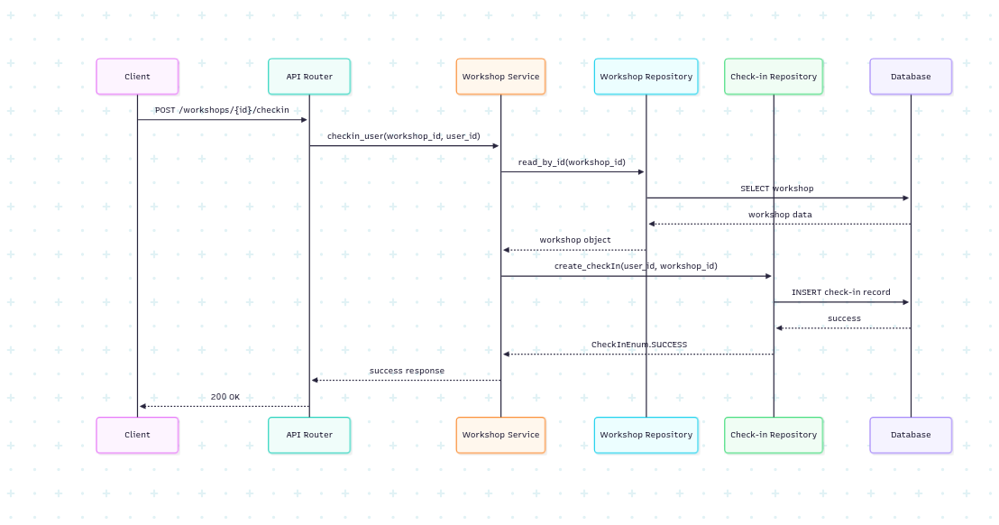

# WorkshopsAPI | Backend for summer team project

## About
Backend part for summer team project. FastAPI + PostgreSQL

## How to start
0. Python >= 3.13 && PostgreSQL >= 15
1. Clone project
```bash
git clone https://github.com/tomatoCoderq/workshops_api
cd workshops_api
```
2. Download uv (package manager as Poetry and pip)
```bash
curl -LsSf https://astral.sh/uv/install.sh | sh #Windows: powershell -ExecutionPolicy ByPass -c "irm https://astral.sh/uv/install.ps1 | iex"
```

3. Create venv 
```bash
uv venv .venv
source .venv/bin/activate  # On Windows: .venv\Scripts\activate
```
4. Install dependencies
```bash
uv pip install -e .
```

5. Create .env. Check out .example.env. for more details

6. Create directory logs in the root of the project

7. To finally start: 
```bash
uv run src/api/__main__.py
```

## Development

### Scrum board
Our board is hosted on GitHub Projects: [WorkshopsAPI](https://github.com/orgs/InNoHassle-Workshops-Check-In/projects/3/views/1)

#### Column Entry Criteria

**Backlog**
- New features, bugs, or improvements identified
- Requirements are clearly defined
- Acceptance criteria are specified
- Priority level is assigned

**To Do**
- Issue is fully analyzed and understood
- Technical approach is defined
- Story points are estimated
- Dependencies are identified

**In Progress**
- Issue is assigned to a team member
- Branch is created and work has started
- Code implementation is actively being developed

**Review**
- Code is complete and ready for review
- Pull request is created with proper description
- All automated tests pass
- Code follows project standards

**Done**
- Code review is approved by at least one team member
- All tests pass in CI/CD pipeline
- Code is merged to main branch
- Issue is closed and documented

### Git workflow

We follow a **GitHub Flow** workflow adapted to our team's needs:

#### Base Workflow
We adapted the **GitHub Flow** workflow, which is a lightweight, branch-based workflow that supports teams and projects where deployments are made regularly.

#### Issue Management
- **Creating Issues**: Use predefined issue templates for [Bug Reports](https://github.com/tomatoCoderq/workshops_api/issues/new?template=bug_report.md) and [Feature Requests](https://github.com/tomatoCoderq/workshops_api/issues/new?template=feature_request.md)
- **Labelling Issues**: 
  - `bug`: Software defects
  - `enhancement`: New features or improvements
  - `documentation`: Documentation updates
  - `good first issue`: Suitable for new contributors
  - `help wanted`: Issues needing assistance
  - `priority: high/medium/low`: Priority levels
- **Assigning Issues**: Team members self-assign or are assigned by project lead based on expertise and availability

#### Branch Management
- **Creating Branches**: 
  - Format: `feature/issue-number-description` or `bugfix/issue-number-description`
  - Example: `feature/123-user-authentication`
- **Naming Branches**: Use kebab-case with descriptive names
- **Base Branch**: Always branch from `main`

#### Commit Messages
Format: `type(scope): description`
- **Types**: `feat`, `fix`, `docs`, `style`, `refactor`, `test`, `chore`
- **Scope**: Optional, describes the part of the codebase affected
- **Description**: Brief description in present tense
- Example: `feat(auth): add JWT token validation`

#### Pull Requests
- **Description**: Include issue number, description of changes, and testing notes
- **Reviewers**: Assign at least one team member for review

#### Code Reviews
- **Review Process**: All PRs require at least one approval
- **Review Criteria**: Code quality, functionality, test coverage, documentation
- **Review Comments**: Be constructive and specific
- **Review Time**: Aim for review within 24 hours

#### Merging Pull Requests
- **Merge Strategy**: Squash and merge to maintain clean history
- **Requirements**: All CI checks must pass, at least one approval
- **Auto-deployment**: Merges to main trigger automatic deployment

#### Issue Resolution
- **Closing Issues**: Link PRs to issues using keywords (fixes #123)
- **Verification**: Ensure the implemented solution meets acceptance criteria
- **Documentation**: Update relevant documentation if needed

#### Git Workflow Diagram


### Secrets management

We follow strict security practices for managing sensitive information:

#### Secret Storage
- **Environment Variables**: All secrets are stored as environment variables
- **GitHub Secrets**: Production secrets are stored in GitHub repository secrets
- **Local Development**: Use `.env` file (not committed to git) for local development
- **CI/CD**: Secrets are injected via GitHub Actions secrets

#### Secret Types
- **Database Credentials**: PostgreSQL connection strings
- **JWT Tokens**: Authentication and authorization tokens
- **API Keys**: External service integrations
- **Server Credentials**: Deployment server access

#### Security Rules
- Never commit secrets to version control
- Use `.env.example` to document required environment variables
- Rotate secrets regularly
- Use least privilege principle for access
- Monitor secret usage and access logs

## Quality assurance

### Quality attribute scenarios
Our quality characteristics are documented in [docs/quality-assurance/quality-attribute-scenarios.md](docs/quality-assurance/quality-attribute-scenarios.md).

### Automated tests

#### Testing Tools
- **pytest**: Primary testing framework for unit and integration tests
- **pytest-asyncio**: Async test support for FastAPI endpoints
- **pytest-cov**: Code coverage measurement and reporting
- **TestClient**: FastAPI testing client for endpoint testing

#### Test Types
- **Unit Tests**: Test individual functions and classes in isolation
- **Integration Tests**: Test component interactions and database operations
- **API Tests**: Test FastAPI endpoints and request/response handling

#### Test Locations
- **Unit Tests**: `src/tests/` directory
  - `src/tests/users/`: User-related tests
  - `src/tests/workshops/`: Workshop-related tests
- **Test Configuration**: `src/tests/conftest.py` contains shared fixtures
- **Coverage Reports**: Generated in `htmlcov/` directory

## Build and deployment

### Continuous Integration

Our CI pipeline is defined in [.github/workflows/python-app.yml](.github/workflows/python-app.yml).

#### CI Workflow Steps
1. **Lint**: Code formatting check with Black
2. **Test**: Run tests with coverage reporting
3. **Deploy**: Automatic deployment to production (on main branch)

#### Static Analysis Tools
- **Black**: Code formatting and style consistency
- **pytest**: Test execution and validation
- **pytest-cov**: Code coverage analysis (minimum 60% threshold)

#### Testing Tools
- **PostgreSQL**: Database testing with containerized PostgreSQL
- **pytest-asyncio**: Async test execution
- **TestClient**: FastAPI endpoint testing

#### CI Workflow Runs
View all CI workflow runs at: [GitHub Actions](https://github.com/InNoHassle-Workshops-Check-In/backend/actions)

### Continuous Deployment

Our CD pipeline is integrated into the CI workflow and automatically deploys to production when code is merged to the main branch.

#### Deployment Process
1. **Trigger**: Push to main branch
2. **Prerequisites**: All CI tests must pass
3. **Deployment**: SSH-based deployment to production server
4. **Service Restart**: Automatic service restart after deployment

#### Deployment Environment
- **Server**: Production server with SSH access
- **Service Management**: Systemd service for backend application
- **Environment**: Production environment variables injected during deployment

## Architecture

### Static view

Our architecture follows a layered approach with clear separation of concerns:

#### Component Diagram


#### Coupling and Cohesion
- **Low Coupling**: Modules are loosely coupled through dependency injection
- **High Cohesion**: Related functionality is grouped within modules
- **Repository Pattern**: Abstracts data access from business logic
- **Dependency Injection**: Enables easy testing and modularity

#### Maintainability Impact
- **Modular Design**: Easy to add new features without affecting existing code
- **Clear Interfaces**: Well-defined contracts between layers
- **Testability**: Each layer can be tested independently
- **Scalability**: Horizontal scaling possible through stateless design

### Dynamic view

#### Sequence Diagram: Workshop Check-in Process


#### Performance Measurement
The workshop check-in process typically completes in **150-300ms** in production, including:
- Database queries: 50-100ms
- Business logic processing: 20-50ms
- Network overhead: 80-150ms

### Deployment view
#### Deployment Architecture


#### Deployment Choices
- **Containerization**: Ready for Docker deployment
- **Stateless Design**: Enables horizontal scaling
- **Database**: PostgreSQL for ACID compliance and complex queries
- **Service Management**: Systemd for process management

#### Customer Deployment
The application can be deployed on the customer's infrastructure using:
1. **Docker Compose**: For development and small-scale deployments
2. **Kubernetes**: For production-scale deployments
3. **Traditional VPS**: Using systemd services and manual deployment

Deployment documentation and scripts are provided in the repository for easy setup.